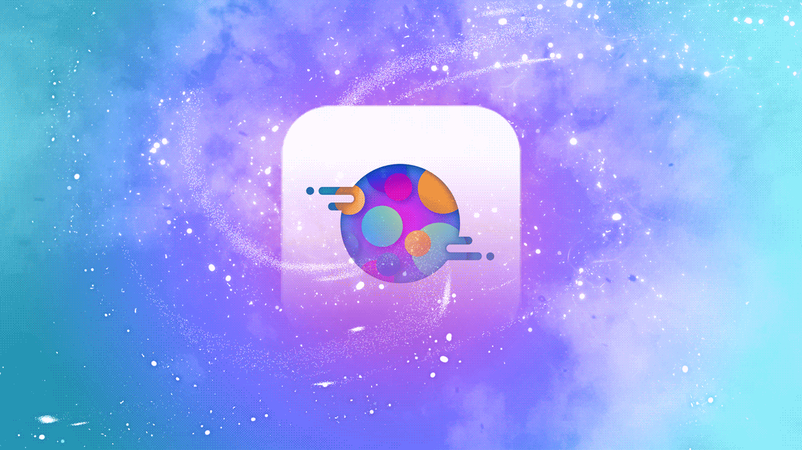

[](https://github.com/searchy2/CustomButton/releases) [](https://github.com/searchy2/CustomButton) [](https://github.com/searchy2/CustomButton) [](https://github.com/searchy2/CustomButton) [](https://github.com/searchy2/CustomButton) [](https://github.com/searchy2/CustomButton) [](https://github.com/searchy2/CustomButton)
# Custom Button



Custom Button provides a beautiful and minimalistic button with outline and drawable support.

This library is part of the Custom UI collection of beautiful, minimalistic, and customizable Android UI components.


# Gradle Dependency

Add this line to your `build.gradle` project. Use the latest release version for the version code. 

```java
repositories {
    maven { url 'https://jitpack.io' }
}
implementation 'com.github.searchy2:CustomButton:latest-version'
```
# Usage

Just drag and drop the following XML into your layout. That's it! 

```java
<stream.custombutton.CustomButton
    android:id="@+id/btn"
    android:layout_width="wrap_content"
    android:layout_height="wrap_content"
    android:text="Custom Button"
    android:textSize="18sp"
    android:singleLine="true"
    android:ellipsize="none"
    app:btn_cornerRadius="20dp"
    app:btn_strokeWidth="1dp"
    app:btn_strokeColor="#008af9"
    app:btn_buttonColor="#00FFFFFF"
    app:btn_buttonSelectColor="#008af9"
    app:btn_textColor="#008af9"
    app:btn_textSelectColor="#FFFFFF"/>
``` 

# Customization

Custom Button can be customized via XML and programmatically. Custom Button extends AppCompatTextView so all TextView functionality is available in addition to the methods listed below. 

### XML Attributes

`btn_buttonColor` - background color. 

`btn_buttonSelectColor` - background color when pressed. 

`btn_strokeColor` - outline color.

`btn_strokeSelectColor` - outline color when pressed. 

`btn_textColor` - text color.

`btn_textSelectColor` - text color when pressed. 

`btn_strokeWidth` - outline thickness (in px).

`btn_cornerRadius` - rounded corners (in px).

### Programmatically

`setPressStatus(boolean isPress)` - set button appearance to selected/unselected state.

`setDrawableLeft(int imgResId)` - set button left drawable.

`setDrawableLeft(int imgResId, int width, int height)`

```java
imgResId - drawable ID.
width - drawable width in px.
height - drawable height in px. 
```

`setDrawableRight(int imgResId)` - set button right drawable.

`setDrawableRight(int imgResId, int width, int height)` - set button right drawable with custom width and height parameters.

`setColor(int textnormal, int textselected, int buttonnormal, int buttonselected, int strokenormal, int strokeselected)`

```java
textnormal - text color.
textselected - text color when pressed.
buttonnormal - background color.
buttonselected - background color when pressed.
strokenormal - outline color.
strokeselected - outline color when pressed. 
```
`colorBurn(int RGBValues)` - The value of RGB is made up of alpha (transparency), red (red), green (green), blue (blue). In Android, RGB is usually represented as a hexadecimal. For example: "#FFAABBCC", from the left to the right, every two letters represent alpha (transparency), red, green, blue. Each color has a value of 0 to 255. Using the following shift method, we can get the darkened version of each color. 

View the sample app for additional customization options.

# Features Wishlist

These features would make this library even more awesome. You can contribute to this library by developing any of the features below. Or, if you really want to see a feature developed, you can sponsor me to develop the feature.

---

>Elevation Shadows

Currently, Custom Button does not support elevation or shadows. A current design trend is large drop shadows on buttons. The drop shadows are also colored which creates a really nice glowing look. It would be great if Custom Button supported glowing drop shadows or any drop shadows at all. 

>Gradient Background

Gradient backgrounds are very trendy and all designers are using them in UI mockups. Unfortunately, gradients are very difficult to do well on Android. Custom Button provides a good starting point to create buttons with gradient backgrounds. 

---

Pull requests are most welcome!

If you've fixed a bug or have a feature you've added, just create a pull request. If you've found a bug, file an issue. If you have any questions or would like to discuss upcoming features, please get in touch. You can get in touch with me in the Contact section below. 

# ★ Acknowledgements ★
**♥ Developer ♥**

Ray Li

**♥ Designer ♥**

Ray Li

# ★ Get in Touch ★
<a href="mailto:ray.li.verified@gmail.com">
  
</a>
<a href="https://rayliverified.com">
  
</a>
<a href="https://twitter.com/RayLiVerified">
  
</a>
<a href="https://linkedin.com/in/rayliverified/">
  
</a>
<a href="https://www.uplabs.com/ray">
  
</a>
<a href="https://github.com/searchy2">
  
</a>

#### Search Terms
android button, outline button, button with outline, simple, elegant, iOS button, style, UI, beautiful, customizable button
