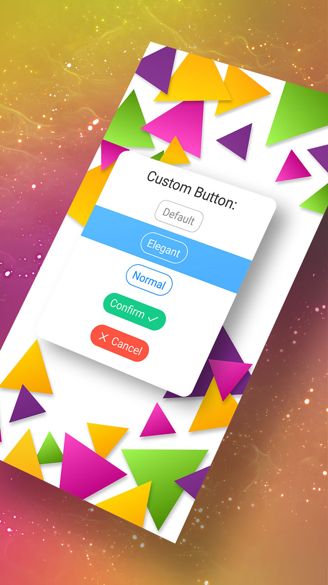

# Custom Button

[](https://github.com/searchy2/CustomButton/releases) [](https://github.com/searchy2/CustomButton) [](https://github.com/searchy2/CustomButton) [](https://github.com/searchy2/CustomButton) [](https://github.com/searchy2/CustomButton) [](https://github.com/searchy2/CustomButton) [](https://github.com/searchy2/CustomButton)


> ### A beautiful and minimalistic button with outline and drawable support.

This library is part of the [Custom UI](http://rayliverified.com/index.php/code/) collection of beautiful, minimalistic, and customizable Android UI components.



# Usage

[](https://github.com/searchy2/CustomButton/releases)

Add this library to `build.gradle`.

```java
repositories {
    maven { url 'https://jitpack.io' }
}
implementation 'com.github.searchy2:CustomButton:latest-version'
```

Use Custom Button in your layout with the following XML.

```java
<stream.custombutton.CustomButton
    android:id="@+id/btn"
    android:layout_width="wrap_content"
    android:layout_height="wrap_content"
    android:text="Custom Button"
    android:textSize="18sp"
    android:singleLine="true"
    android:ellipsize="none"
    app:btn_cornerRadius="20dp"
    app:btn_strokeWidth="1dp"
    app:btn_strokeColor="#008af9"
    app:btn_buttonColor="#00FFFFFF"
    app:btn_buttonSelectColor="#008af9"
    app:btn_textColor="#008af9"
    app:btn_textSelectColor="#FFFFFF"/>
```

## About

CustomButton was created as a replacement for Android's Material buttons. CustomButtons are flat, have better drawable support, and look consistent across Android versions. Here at Codelessly, we're building a Flutter website/app builder, development tools, and UI templates to increase productivity. If that sounds interesting, you'll want to subscribe to updates below 😎

CustomButton is licensed under Zero-Clause BSD and released as Emailware. If you like this project or it helped you, please subscribe to updates. Although it is not required, you might miss the goodies we share!

<a href="https://codelessly.com/?utm_medium=banner&utm_campaign=newsletter_subscribe" target="_blank"></a>

# Examples


```java
<stream.custombutton.CustomButton
    android:id="@+id/btn1"
    android:layout_width="wrap_content"
    android:layout_height="wrap_content"
    android:paddingTop="6dp"
    android:paddingBottom="6dp"
    android:paddingLeft="12dp"
    android:paddingRight="12dp"
    android:layout_marginTop="10dp"
    android:layout_marginBottom="10dp"
    android:layout_gravity="center_horizontal"
    android:gravity="center"
    android:text="Default"
    android:textSize="18sp"
    android:singleLine="true"
    android:ellipsize="none"/>
```


```java
<stream.custombutton.CustomButton
    android:id="@+id/btn2"
    android:layout_width="wrap_content"
    android:layout_height="wrap_content"
    android:paddingTop="6dp"
    android:paddingBottom="6dp"
    android:paddingLeft="12dp"
    android:paddingRight="12dp"
    android:layout_marginTop="10dp"
    android:layout_marginBottom="10dp"
    android:layout_gravity="center_horizontal"
    android:gravity="center"
    android:text="Elegant"
    android:textSize="18sp"
    android:singleLine="true"
    android:ellipsize="none"
    app:btn_cornerRadius="20dp"
    app:btn_strokeWidth="1dp"
    app:btn_strokeColor="@color/white"
    app:btn_strokeSelectColor="@color/white_pressed"
    app:btn_buttonColor="@color/transparent"
    app:btn_textColor="@color/white"
    app:btn_textSelectColor="@color/white_pressed"/>

```


```java
<stream.custombutton.CustomButton
    android:id="@+id/btn3"
    android:layout_width="wrap_content"
    android:layout_height="wrap_content"
    android:paddingTop="6dp"
    android:paddingBottom="6dp"
    android:paddingLeft="12dp"
    android:paddingRight="12dp"
    android:layout_marginTop="10dp"
    android:layout_marginBottom="10dp"
    android:layout_gravity="center_horizontal"
    android:gravity="center"
    android:text="Normal"
    android:textSize="18sp"
    android:singleLine="true"
    android:ellipsize="none"
    app:btn_cornerRadius="20dp"
    app:btn_strokeWidth="1dp"
    app:btn_strokeColor="#008af9"
    app:btn_buttonColor="@color/transparent"
    app:btn_buttonSelectColor="#008af9"
    app:btn_textColor="#008af9"
    app:btn_textSelectColor="@color/white"/>

```


```java
<stream.custombutton.CustomButton
    android:id="@+id/btn4"
    android:layout_width="wrap_content"
    android:layout_height="wrap_content"
    android:paddingTop="2dp"
    android:paddingBottom="6dp"
    android:paddingLeft="12dp"
    android:paddingRight="12dp"
    android:layout_marginTop="10dp"
    android:layout_marginBottom="10dp"
    android:layout_gravity="center_horizontal"
    android:gravity="center"
    android:text="Confirm"
    android:textSize="18sp"
    android:singleLine="true"
    android:ellipsize="none"
    app:btn_cornerRadius="20dp"
    app:btn_strokeWidth="1dp"
    app:btn_buttonColor="@color/green"
    app:btn_buttonSelectColor="@color/green_light"
    app:btn_strokeColor="@color/green"
    app:btn_strokeSelectColor="@color/green_light"
    app:btn_textColor="@color/white"/>

```


```java
<stream.custombutton.CustomButton
    android:id="@+id/btn5"
    android:layout_width="wrap_content"
    android:layout_height="wrap_content"
    android:paddingTop="2dp"
    android:paddingBottom="6dp"
    android:paddingLeft="12dp"
    android:paddingRight="12dp"
    android:layout_marginTop="10dp"
    android:layout_marginBottom="10dp"
    android:layout_gravity="center_horizontal"
    android:gravity="center"
    android:text="Cancel"
    android:textSize="18sp"
    android:singleLine="true"
    android:ellipsize="none"
    app:btn_cornerRadius="20dp"
    app:btn_strokeWidth="1dp"
    app:btn_buttonColor="@color/red"
    app:btn_buttonSelectColor="@color/red_light"
    app:btn_strokeColor="@color/red"
    app:btn_strokeSelectColor="@color/red_light"
    app:btn_textColor="@color/white"/>

```
# Customization

Custom Button can be customized via XML and programmatically. Custom Button extends AppCompatTextView so all TextView functionality is available in addition to the methods listed below. 

### XML Attributes

|Attribute|Description| 
|--|--|
|btn_buttonColor|default background color|
|btn_buttonSelectColor|selected background color|
|btn_strokeColor|default outline color|
|btn_strokeSelectColor|selected outline color|
|btn_textColor|default text color|
|btn_textSelectColor|selected text color|
|btn_strokeWidth|outline thickness (px)|
|btn_cornerRadius|rounded corners radius (px)|

### Programmatically

|Method|Description| 
|--|--|
|setPressStatus(boolean isPress)|set button appearance to selected/default state|
|setDrawableLeft(int imgResId)|set button left drawable|
|setDrawableLeft(int imgResId, int width, int height)|set button left drawable with custom width and height parameters </br> `imgResId - drawable ID` </br> `width - drawable width in px` </br> `height - drawable height in px`|
|setDrawableRight(int imgResId)|set button right drawable|
|setDrawableRight(int imgResId, int width, int height)|set button right drawable with custom width and height parameters </br> `imgResId - drawable ID` </br> `width - drawable width in px` </br> `height - drawable height in px`|
|setColor(int textnormal, int textselected, int buttonnormal, int buttonselected, int strokenormal, int strokeselected)|`textnormal - text color` </br> `textselected - text color when pressed` </br> `buttonnormal - background color` </br> `buttonselected - background color when pressed` </br> `strokenormal - outline color` </br> `strokeselected - outline color when pressed` |
|colorBurn(int RGBValues)|Get the darkened version of each color. The value of RGB is made up of alpha (transparency), red (red), green (green), blue (blue). In Android, RGB is usually represented as a hexadecimal. For example: "#FFAABBCC", from the left to the right, every two letters represent alpha (transparency), red, green, blue. Each color has a value of 0 to 255. This method shifts the color values and darkens the color. |

View the sample app for additional customization options.

# Features Wishlist

These features would make this library even more awesome. Please contribute to this library by developing any of the features below.

---

>Elevation Shadows

Currently, Custom Button does not support elevation or shadows. A current design trend is large drop shadows on buttons. The drop shadows are also colored which creates a really nice glowing look. It would be great if Custom Button supported glowing drop shadows or any drop shadows at all. 

>Gradient Background

Gradient backgrounds are very trendy and all designers are using them in UI mockups. Unfortunately, gradients are very difficult to do well on Android. Custom Button provides a good starting point to create buttons with gradient backgrounds. 

---

Pull requests are most welcome!

If you've fixed a bug or have a feature you've added, just create a pull request. If you've found a bug, file an issue. If you have any questions or would like to discuss upcoming features, please get in touch. You can get in touch with me in the Contact section below. 

# ★ Acknowledgements ★
**♥ Developer ♥**

[Ray Li](https://rayliverified.com)

**♥ Designer ♥**

[Ray Li](https://rayliverified.com)

**♥ Sponsor ♥**

[Codelessly - Flutter Website and App Builder](https://codelessly.com/?utm_medium=link&utm_campaign=direct)

# ★ Get in Touch ★
<a href="mailto:ray@codelessly.com">
  
</a>
<a href="https://rayliverified.com">
  
</a>
<a href="https://twitter.com/RayLiVerified">
  
</a>
<a href="https://linkedin.com/in/rayliverified/">
  
</a>
<a href="https://www.uplabs.com/ray">
  
</a>
<a href="https://github.com/searchy2">
  
</a>

# Apps Using This Library

Include your app here by making a `pull request`. 

<table>
    <tr>
		<td></td>
		<td><a href="https://github.com/searchy2/Rocket-Notes">Rocket Notes</a></td>
	</tr>
	<tr>
		<td></td>
		<td><a href="https://play.google.com/store/apps/details?id=io.ideastarter">Crowdfunding Community</a></td>
	</tr>
    <tr>
		<td></td>
		<td><a href="https://play.google.com/store/apps/details?id=com.blankicon">Blank Icon</a></td>
	</tr>
</table>

#### Search Terms
android button, outline button, button with outline, simple, elegant, iOS button, style, UI, beautiful, customizable button
